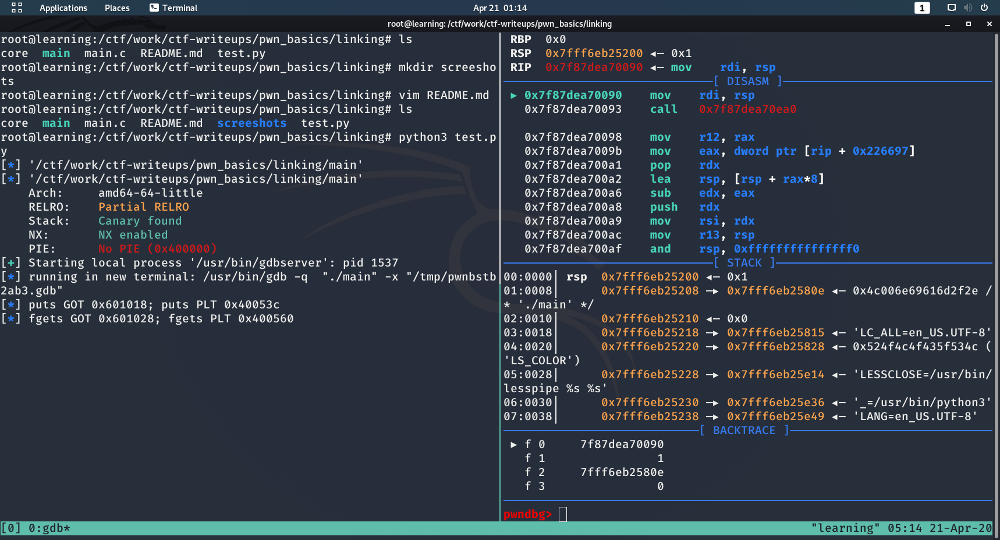
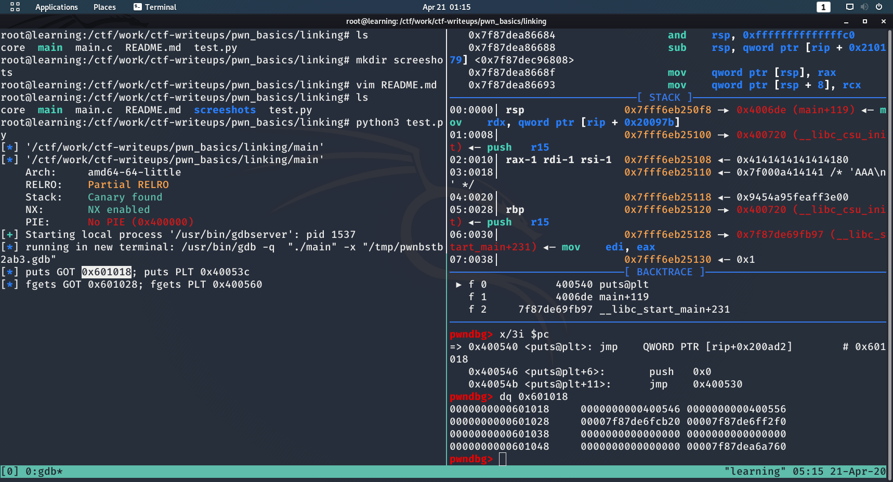
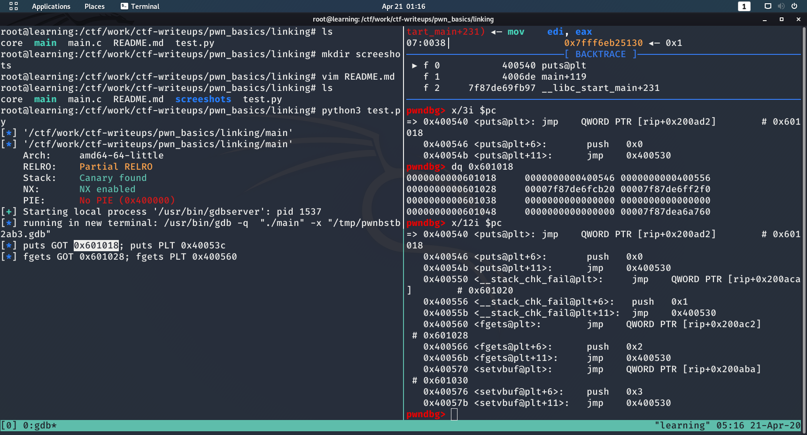
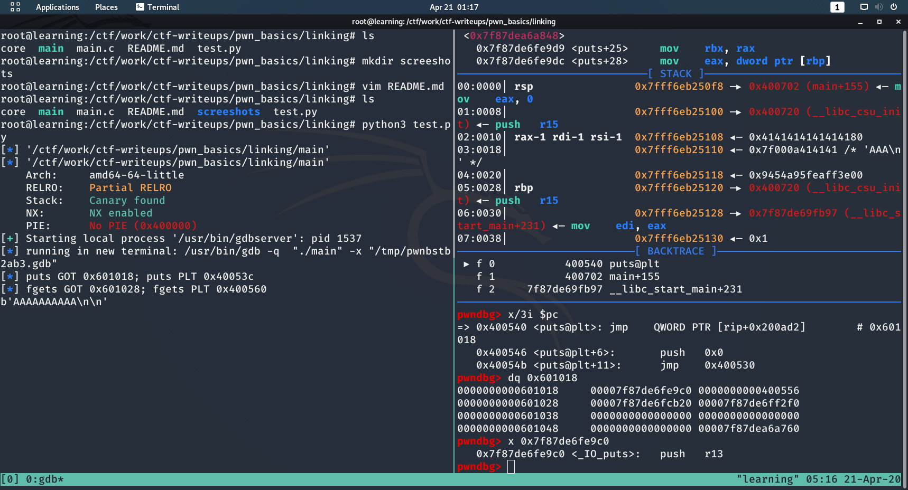

# GOT/PLT for Pwners

## Exploring the GOT and PLT 
When programs are dynamically linked, the addresses of functions that exist in shared libraries (printf, malloc) are not known until runtime. The GOT (Global Offset Table) and PLT (Procedure Linkage Table) exist to avoid this address resolution until the program actually needs to use the function imported from the library. This technique is known as lazy binding, which is an optimization based on the fact that programs might not need all functions that they import during every run of a program.

In order to understanding how these tables are filled during the runtime of the program, let's debug a really useless C-program in GDB and trace the path of execution from the initial call to the library functions all the way to the PLT.  

```C
#include <stdlib.h>
#include <stdio.h> 

int main(){ 
        char buf[15]; 

        fgets(buf, 15, stdin); 
        puts(buf); 

        fgets(buf, 15, stdin);
        puts(buf); 
        return 0; 
} 
```

```sh
gcc -no-pie main.c -o main 
```
Using the `test.py` program, it sets one breakpoint at the PLT entry for puts. When running the program, let's check how the GOT entry for changes from the first time the program hits that PLT entry to the second time. 

To get `test.py` working, you'll need to install tmux. Once you have that installed, just type `tmux` in your terminal and you can run `test.py`. 

For your GDB output to look like the screenshots below, you'll need [Pwndbg](https://github.com/pwndbg/pwndbg). 

 
 
 
  
## GOT Milk Aside 
You probably see why it's called GOT Milk, now.

